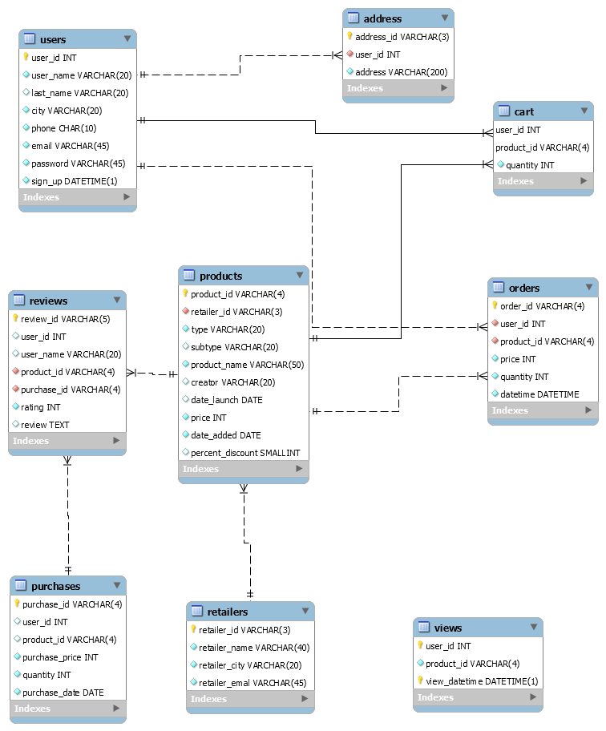

## SQL and Database Design

A database schema of an E-commerce platform was designed.
The following functionalites are provided by this database schema design.
<ul>
    <li>Search for products.</li>
    <li>Browse through products available on sale.</li>
    <li>Add products to their cart and save them for later.</li>
    <li>Buy products.</li>
    <li>Rate and add reviews for products they bought in the past.</li>
    <li>Browse through their past orders.</li>
    <li>Product recommendation by the platform based on their purchase and search history.</li>
</ul>

The database was populated with arbitary data. Various queries were made on the database to ensure the above mentioned functionalities. The schema diagram of the database is shown below. 

 